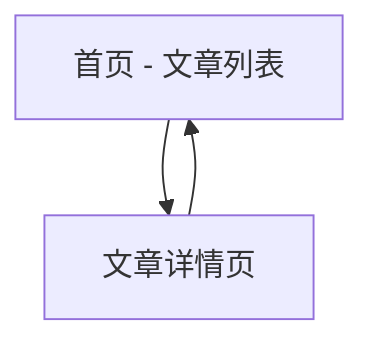

# 英语学习网站产品需求文档

## 1. Product Overview
英语学习网站是一个专注于提供优质英语阅读材料的在线学习平台。用户可以通过阅读精选的英语文章来提升英语阅读能力和语言水平。
- 解决英语学习者缺乏优质阅读材料和便捷学习平台的问题，为英语学习者提供系统化的阅读练习环境。
- 目标是成为英语学习者首选的在线阅读学习平台，帮助用户提升英语阅读理解能力。

## 2. Core Features

### 2.1 Feature Module
我们的英语学习网站包含以下主要页面：
1. **首页**：文章列表展示、导航菜单、搜索功能
2. **文章详情页**：文章内容展示、阅读工具、返回按钮

### 2.2 Page Details

| Page Name | Module Name | Feature description |
|-----------|-------------|---------------------|
| 首页 | 文章列表 | 展示所有可用的英语文章，包含文章标题、简介预览，支持点击进入详情页 |
| 首页 | 导航菜单 | 提供网站导航功能，包含首页链接和其他功能入口 |
| 首页 | 搜索功能 | 允许用户根据关键词搜索相关文章 |
| 文章详情页 | 文章内容展示 | 完整显示文章标题和内容，提供良好的阅读体验 |
| 文章详情页 | 阅读工具 | 提供字体大小调节、阅读进度显示等辅助功能 |
| 文章详情页 | 返回按钮 | 允许用户返回文章列表页面 |

## 3. Core Process
用户访问网站首页，浏览文章列表，选择感兴趣的文章点击进入详情页进行阅读，阅读完成后可返回首页继续选择其他文章。

## 4. User Interface Design
### 4.1 Design Style
- 主色调：深蓝色 (#2563eb) 和白色 (#ffffff)
- 辅助色：浅灰色 (#f8fafc) 和深灰色 (#64748b)
- 按钮样式：圆角按钮，悬停效果
- 字体：系统默认字体，标题使用 24px，正文使用 16px
- 布局风格：简洁的卡片式布局，顶部导航栏
- 图标风格：简洁的线性图标

### 4.2 Page Design Overview

| Page Name | Module Name | UI Elements |
|-----------|-------------|-------------|
| 首页 | 文章列表 | 卡片式布局，每个文章卡片包含标题、预览文本、阅读按钮。使用网格布局，响应式设计 |
| 首页 | 导航菜单 | 顶部固定导航栏，包含网站Logo、首页链接，使用深蓝色背景 |
| 首页 | 搜索功能 | 搜索框位于页面顶部，圆角设计，带搜索图标 |
| 文章详情页 | 文章内容展示 | 居中布局，最大宽度限制，良好的行间距和段落间距，标题使用大字体 |
| 文章详情页 | 阅读工具 | 浮动工具栏，包含字体大小调节按钮，位于页面右侧 |
| 文章详情页 | 返回按钮 | 位于页面左上角，使用箭头图标和文字组合 |

### 4.3 Responsiveness
网站采用移动优先的响应式设计，在桌面端、平板和手机端都能提供良好的用户体验，支持触摸交互优化。