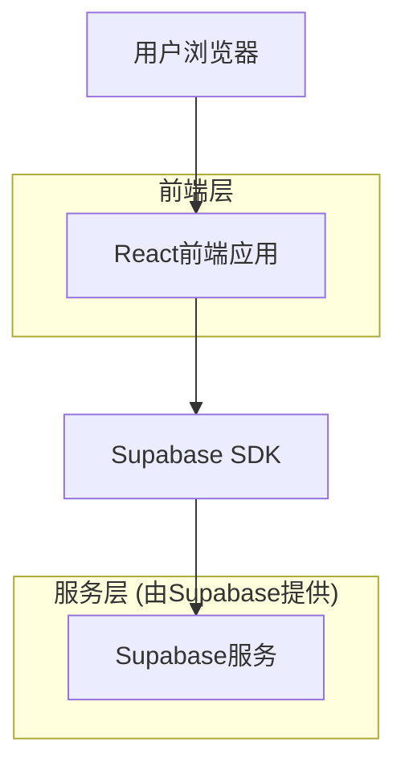
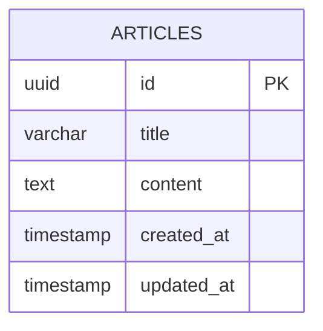

# 英语学习网站技术架构文档

## 1. Architecture design



## 2. Technology Description
- 前端: React@18 + tailwindcss@3 + vite
- 后端: Supabase
- 数据库: Supabase (PostgreSQL)

## 3. Route definitions

| Route | Purpose |
|-------|----------|
| / | 首页，展示所有文章列表 |
| /article/:id | 文章详情页，显示具体文章内容 |

## 4. API definitions

### 4.1 Core API

文章相关API（通过Supabase SDK调用）

**获取所有文章**
```javascript
// 获取文章列表
const { data: articles, error } = await supabase
  .from('articles')
  .select('id, title, content')
  .order('created_at', { ascending: false })
```

**获取单篇文章**
```javascript
// 根据ID获取文章详情
const { data: article, error } = await supabase
  .from('articles')
  .select('*')
  .eq('id', articleId)
  .single()
```

**搜索文章**
```javascript
// 根据标题搜索文章
const { data: articles, error } = await supabase
  .from('articles')
  .select('id, title, content')
  .ilike('title', `%${searchTerm}%`)
```

## 5. Data model

### 5.1 Data model definition



### 5.2 Data Definition Language

**文章表 (articles)**
```sql
-- 创建文章表
CREATE TABLE articles (
    id UUID PRIMARY KEY DEFAULT gen_random_uuid(),
    title VARCHAR(255) NOT NULL,
    content TEXT NOT NULL,
    created_at TIMESTAMP WITH TIME ZONE DEFAULT NOW(),
    updated_at TIMESTAMP WITH TIME ZONE DEFAULT NOW()
);

-- 创建索引
CREATE INDEX idx_articles_created_at ON articles(created_at DESC);
CREATE INDEX idx_articles_title ON articles USING gin(to_tsvector('english', title));

-- 设置RLS (Row Level Security)
ALTER TABLE articles ENABLE ROW LEVEL SECURITY;

-- 创建策略：允许所有用户读取文章
CREATE POLICY "Allow public read access" ON articles
    FOR SELECT USING (true);

-- 授权
GRANT SELECT ON articles TO anon;
GRANT ALL PRIVILEGES ON articles TO authenticated;

-- 插入示例数据
INSERT INTO articles (title, content) VALUES 
('Welcome to English Learning', 'This is your first English article. Reading is one of the most effective ways to improve your English skills. Through consistent practice and exposure to various texts, you can enhance your vocabulary, grammar understanding, and overall language proficiency.'),
('The Benefits of Daily Reading', 'Daily reading habits can significantly improve your English comprehension. When you read regularly, you encounter new words in context, which helps you understand their meanings naturally. Additionally, reading exposes you to different writing styles and sentence structures.'),
('Building Your Vocabulary', 'A strong vocabulary is essential for effective communication in English. The best way to build vocabulary is through extensive reading. When you encounter unfamiliar words, try to understand them from context before looking them up in a dictionary.');
```

**更新时间触发器**
```sql
-- 创建更新时间的触发器函数
CREATE OR REPLACE FUNCTION update_updated_at_column()
RETURNS TRIGGER AS $$
BEGIN
    NEW.updated_at = NOW();
    RETURN NEW;
END;
$$ language 'plpgsql';

-- 为articles表创建触发器
CREATE TRIGGER update_articles_updated_at 
    BEFORE UPDATE ON articles 
    FOR EACH ROW 
    EXECUTE FUNCTION update_updated_at_column();
```